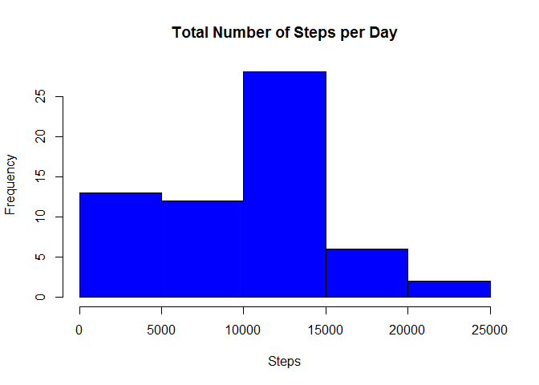
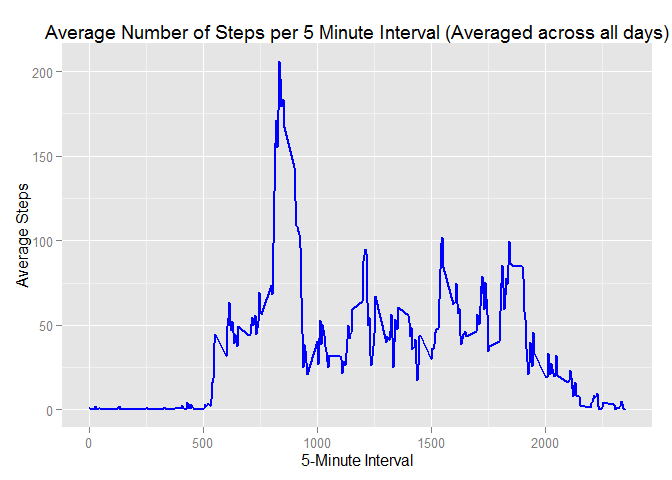
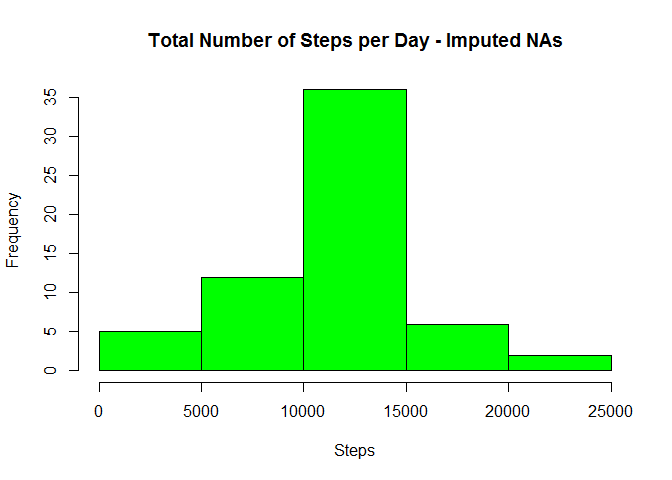
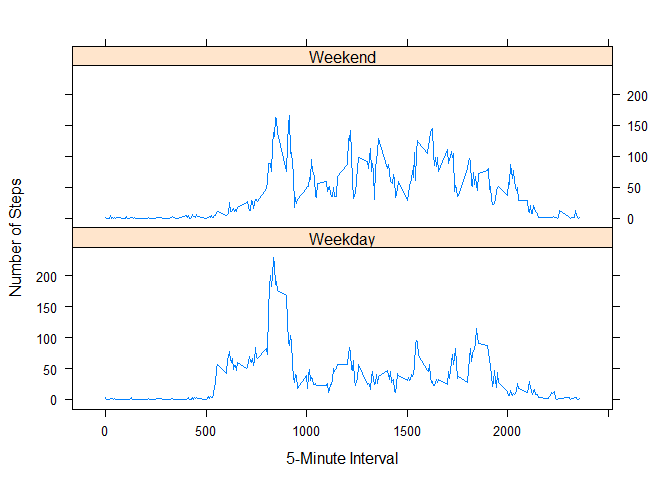

# Reproducible Research: Peer Assessment 1


## Loading and preprocessing the data


```r
data <- read.csv("activity.csv", stringsAsFactors = FALSE);

# Convert the date column to the R date type

data$date <- as.POSIXct(data$date);

# Show a quick summary of the data

summary(data);
```

```
##      steps             date                        interval     
##  Min.   :  0.00   Min.   :2012-10-01 00:00:00   Min.   :   0.0  
##  1st Qu.:  0.00   1st Qu.:2012-10-16 00:00:00   1st Qu.: 588.8  
##  Median :  0.00   Median :2012-10-31 00:00:00   Median :1177.5  
##  Mean   : 37.38   Mean   :2012-10-31 00:25:34   Mean   :1177.5  
##  3rd Qu.: 12.00   3rd Qu.:2012-11-15 00:00:00   3rd Qu.:1766.2  
##  Max.   :806.00   Max.   :2012-11-30 00:00:00   Max.   :2355.0  
##  NA's   :2304
```


## What is mean total number of steps taken per day?


```r
# Create a data frame of the data grouped by date

data.stepsperday <- group_by(data, date);

# Calculate the sums steps per day

stepsperday <- summarize(data.stepsperday, stepsperday=sum(steps, na.rm = TRUE));

# Create the histogram

hist(stepsperday$stepsperday, main = "Total Number of Steps per Day", xlab="Steps", ylab="Frequency", col="blue");
```

 

```r
# Calculate the mean and median steps per day

mean(stepsperday$stepsperday);
```

```
## [1] 9354.23
```

```r
median(stepsperday$stepsperday);
```

```
## [1] 10395
```


## What is the average daily activity pattern?


```r
# Group the data by steps per interval

data.stepsperinterval <- group_by(data, interval);

# Calculate the mean steps per interval

stepsperinterval <- summarize(data.stepsperinterval, stepsperinterval=mean(steps, na.rm = TRUE));

# Plot the average steps per interval

ggplot(data=stepsperinterval, aes(x=interval, y=stepsperinterval)) +
  geom_line(size=1, col="blue") +
  xlab("5-Minute Interval") +
  ylab("Average Steps") +
  ggtitle("Average Number of Steps per 5 Minute Interval (Averaged across all days)");
```

 

```r
# Calculate the 5 minute interval with the highest average steps

stepsperinterval$interval[which.max(stepsperinterval$stepsperinterval)];
```

```
## [1] 835
```

## Imputing missing values


```r
# Calculate the number of NAs in the data

sum(is.na(data));
```

```
## [1] 2304
```

```r
# Create an imputed value based on the mean per interval

imputedvalues <- numeric();

for(i in 1:nrow(data))
{
  activity <- data[i,];
  
  if(is.na(activity$steps))
  {
    # use the average steps for the interval as the imputed value
    
    imputedvalues <- c(imputedvalues, stepsperinterval[stepsperinterval$interval == activity$interval]$steps);
  }
  else
  {
    imputedvalues <- c(imputedvalues, activity$steps);
  }
}

# Create a new data frame with the a copy of the data

data.imputedvalues <- data;

# Overwrite the steps in the new data frame with the imputed values

data.imputedvalues$steps <- imputedvalues;

# Group the data by date

data.stepsperdayimputed <- group_by(data.imputedvalues, date);

# Calculate the average steps per day

stepsperdayimputed <- summarize(data.stepsperdayimputed, stepsperday=sum(steps, na.rm = TRUE));

# Create the histogram

hist(stepsperdayimputed$stepsperday, main = "Total Number of Steps per Day - Imputed NAs", xlab="Steps", ylab="Frequency", col="green");
```

 

```r
# Calculate the mean and median steps per day for the data with imputed NA values

mean(stepsperdayimputed$stepsperday);
```

```
## [1] 10766.19
```

```r
median(stepsperdayimputed$stepsperday);
```

```
## [1] 10766.19
```

Imputing the NA values of steps appears to make the steps per day histogram look significantly more normally distributed.  The mean increases significantly while the median increases but to a lesser degree.  Also, after imputing, the mean and median are almost exactly the same, suggesting the data is now less skewed.

## Are there differences in activity patterns between weekdays and weekends?


```r
# Calculate the day of week value for each day in the data

dayofweek <- weekdays(data.imputedvalues$date);

daytype <- vector();

# Calculate the day of week type from the day of week values

for (i in 1:nrow(data.imputedvalues))
{
  if ((dayofweek[i] == "Saturday") || (dayofweek[i] == "Sunday"))
  {
    daytype[i] <- "Weekend";
  }
  else
  {
    daytype[i] <- "Weekday";
  }
}

data.imputedvalues$daytype <- daytype;

# Turn the day of week type to a factor and insert it into the imputed data frame

data.imputedvalues$daytype <- factor(data.imputedvalues$daytype);

data.stepsperintervalimputed <- group_by(data.imputedvalues, interval, daytype);
stepsperintervalimputeddaytype <- summarize(data.stepsperintervalimputed, stepsperinterval=mean(steps, na.rm = TRUE));

# Create a panel plot of the Weekend and Weekdays average steps per five minute interval

xyplot(stepsperinterval ~ interval | daytype, stepsperintervalimputeddaytype, type = "l", layout = c(1, 2), xlab = "5-Minute Interval", ylab = "Number of Steps");
```

 

It appears from the panel plot above that on weekdays the highest steps per interval occur early and late in the day.  However, on the weekends, the steps per day tend to be more consistent throughout the daywith the peaks being more frequently throughout the midday.
